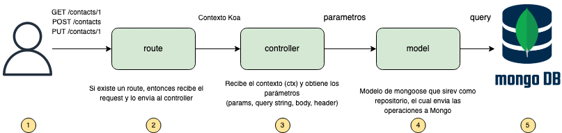

<h1 align="center">Workshop contruyendo una API Rest con Node.js + Koa.js</h1>

<div align="center">
    
</div>

## Tabla de Contenido

- [Tabla de Contenido](#tabla-de-contenido)
- [Acerca de](#acerca-de)
- [Introducción](#introducción)
- [Explicación del Caso de Uso](#explicación-del-caso-de-uso)
- [Ciclo de Vida de las Solicitudes HTTP en nuestra API](#ciclo-de-vida-de-las-solicitudes-http-en-nuestra-api)
- [Requisitos](#requisitos)
  - [Super Importante](#super-importante)
  - [Recomendado](#recomendado)
- [Episodios](#episodios)
- [Stack](#stack)
- [Estructura del Proyecto](#estructura-del-proyecto)

## Acerca de

Hola gente!! Si te fijas en el nombre del repositorio *nodejs-learning-path-api-using-koa-workshop*. Mi idea es ir creando una serie de repositorios acompañados de documentación los cuales sirvan para aquellas personas que desean profundizar su conocimeinto en Node.js y desean conocer algunas herramientas, prácticas, frameworks para convertirse un desarrollador backend pro. Proximamente estaré creando más contenido que aborde temas que hoy dia son necesarios en el campo laboral del mundo real.

Espero que encuentrés este contenido útil y si lo aprecias te invito a darle una :star: en github :smiley:

## Introducción

En este Workshop está dirigido a desarrolladores que quieren aprender o reforzar como construir una `API Rest` usando [Node.js](https://nodejs.org/) y [Koa.js](https://koajs.com/#introduction).

Por si aun no conoces Koa.js, te cuento que se trata de un web framework es decir es una alternativa mas ligera a [Express.js](https://expressjs.com/es/) (incluso construido por el mismo team de Express).

Dividiremos este taller en `4 partes que llamaremos Episodios`, en cada uno agregaremos algún complemento que nos ayudará a entender cómo nuestra API irá evolucionando con el fin de añadirle funcionalidades técnicas que vas a necesitar en el mundo real.

Quieres saber el contenido de los epidosdios? ve a la sección [Episodios](#episodios)

## Explicación del Caso de Uso

Esta API de ejemplo es muy simple, expondrá algunos métodos para poder obtener (GET) un contacto que tenemos en una base de datos de MongoDB. Tambien nos permitirá crear nuevos contactos (POST) o actualizar sus datos (PUT).

## Ciclo de Vida de las Solicitudes HTTP en nuestra API

Cada vez que un usuario realiza una petición por ejemplo a *http://localhost:3000/contacts* ya sea que realiza un GET o un POST (con los parámetros adecuados), nuestra aplicación escucha a través de los enrutamientos (routes) que hemos definido y esto dispara todo el flujo de invocaciónes necesarias para finalzar el procesamiento de cada solicitud. En la siguiente imagen se muestra como es el flujo de la petición que pasa entre los elemntos más importantes de nuestra api.



## Requisitos

Antes de empezar revisa ue cumplas con los siguientes requisitos:
### Super Importante

- [Node.js](https://nodejs.org/) puede ser la version LTS o la actual
- [Git](https://git-scm.com/)
- [Visual Studio Code](https://code.visualstudio.com/)
- Acceso a una base de datos MongoDB en caso de que no tengas una, [este link te ayudará a crearla en Atlas o Docker](https://github.com/jriverox/data-sample-resources#mongodb)
- Cargar la data de ejemplo en tu base de datos MongoDB
  - [Descarga el json con la data de ejemplo](https://github.com/jriverox/data-sample-resources#contactos-esquema-demo)
  - [Carga la data del json en una BD usando Compass](https://github.com/jriverox/data-sample-resources#usando-compass)
### Recomendado

- Extensión de VS Code [EditorConfig for VS Code](https://marketplace.visualstudio.com/items?itemName=EditorConfig.EditorConfig)
- Extensión de VS Code [ESLint](https://marketplace.visualstudio.com/items?itemName=dbaeumer.vscode-eslint)
- Extensión de VS Code [Path Intellisense](https://marketplace.visualstudio.com/items?itemName=christian-kohler.path-intellisense)
- Extensión de VS Code [Visual Studio IntelliCode](https://marketplace.visualstudio.com/items?itemName=VisualStudioExptTeam.vscodeintellicode)
- Extensión de VS Code [YAML](https://marketplace.visualstudio.com/items?itemName=redhat.vscode-yaml)
- Extensión de VS Code [Prettier](https://marketplace.visualstudio.com/items?itemName=esbenp.prettier-vscode)
- Extensión de VS Code [npm Intellisense](https://marketplace.visualstudio.com/items?itemName=christian-kohler.npm-intellisense)
- Extensión de VS Code [gitignore](https://marketplace.visualstudio.com/items?itemName=codezombiech.gitignore)

## Episodios

Como se mencionó anterioremente la idea es implementar una API Rest para cubrir las necesidades de indicadas en el Caso de Uso. Pero la idea es ofrecer varios enfoques:

- [Episodio 1: Creando un API rest con Node.js, Koa.js y MongoDB](./documentation/episode-1.md)
- [Episodio 2: Protegiendo el acceso del API](./documentation/episode-2.md)
- [Episodio 3: Validando los Requests](./documentation/episode-3.md)
- [Episodio 4: Manejo de Errores](./documentation/episode-4.md)
- [Episodio 5: Unit Tests + Integration Tests](./documentation/episode-5.md)
- [Episodio 6: Evaluando el Código usando SonaQube](./documentation/episode-6.md)

## Stack

- [Koa](https://github.com/koajs/koa) - Web framework. Esta librería esta hecha por el equipo de express, y es más ligera que express.
- [Mongoose](https://mongoosejs.com/) - proporciona una solución directa basada en esquemas para modelar los datos de su aplicación con MongoDB
- [EsLint](https://eslint.org/) - ESLint es una herramienta para identificar e informar sobre ruptura de estandares encontrados en el código ECMAScript / JavaScript.
- [Prettier](https://prettier.io/) - Formateador de código, que nos ayuda a mantener limpio y alienado a los estandares.
- [joi](https://www.npmjs.com/package/joi) - Nos permite definir esquemas de validación, lo cual nos da la oportunidad de validar los parametros que recibamos en las solicitudes http.
- [swagger2](https://github.com/carlansley/swagger2#readme) - Lo usaremos para cargar la documentación de nuestra api
- [winston](https://github.com/winstonjs/winston#readme) - Un logger poderoso y popular en node.js
- [yenv](https://github.com/jeffijoe/yenv#readme) - Nos permite manejar variables de entorno desde un archivo YAML
- [jest](https://github.com/facebook/jestt) - Un framework muy popular para Testing
- [@shopify/jest-koa-mocks](https://www.npmjs.com/package/@shopify/jest-koa-mocks). - Librería para mocks http para testing en koa
- [supertest](https://github.com/visionmedia/supertest#readme) - Modulo que nos permite realizar pruebas de solicitudes http
- [cross-env](https://github.com/kentcdodds/cross-env#readme) - Facilita establecer el valor de la variable de entorno NODE_ENV

## Estructura del Proyecto

```
📦api-node-koa-workshop
  📦src
  ┣ 📂controllers
  ┃ ┣ 📜auth.controller.js
  ┃ ┗ 📜contacts.controller.js
  ┣ 📂middleware
  ┃ ┣ 📜auth.js
  ┃ ┣ 📜error-handler.js
  ┃ ┗ 📜schema-validator.js
  ┣ 📂models
  ┃ ┣ 📜contact.model.js
  ┃ ┗ 📜user.model.js
  ┣ 📂routes
  ┃ ┣ 📜auth.route.js
  ┃ ┗ 📜contacts.route.js
  ┣ 📂schemas
  ┃ ┗ 📜contacts.schema.js
  ┣ 📂utils
  ┃ ┗ 📂logging
  ┃ ┃ ┣ 📜app-error.js
  ┃ ┃ ┣ 📜common-errors.js
  ┃ ┃ ┣ 📜error-factory.js
  ┃ ┃ ┗ 📜log-manager.js
  ┣ 📜app.js
  ┣ 📜routes.js
  ┗ 📜server.js
  📦tests
  ┣ 📂integration
  ┃ ┣ 📜auth.spec.js
  ┃ ┗ 📜contacts.spec.js
  ┣ 📂mock-data
  ┃ ┣ 📜contact.json
  ┃ ┣ 📜contacts-invalid-cases.json
  ┃ ┣ 📜token.json
  ┃ ┗ 📜user.json
  ┗ 📂unit
  ┃ ┣ 📜auth.controller.spec.js
  ┃ ┣ 📜auth.middleware.spec.js
  ┃ ┣ 📜contacts.controller.spec.js
  ┃ ┗ 📜schema-validator.middleware.spec.js
  ┣ 📜.editorconfig
  ┣ 📜.eslintrc.yml
  ┣ 📜.gitignore
  ┣ 📜.prettierrc.js
  ┣ 📜LICENSE
  ┣ 📜README.md
  ┣ 📜env.yaml
  ┣ 📜jest.config.js
  ┣ 📜package-lock.json
  ┣ 📜package.json
```
